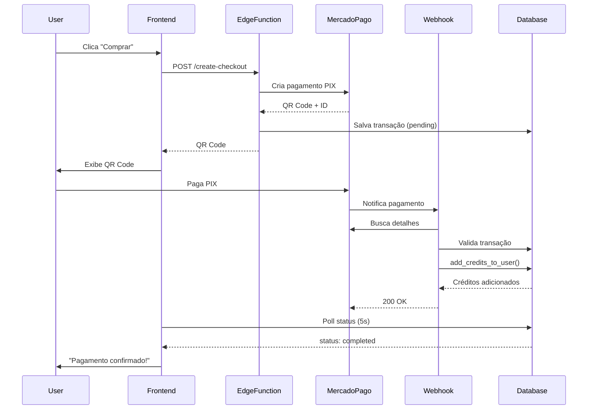

# 💳 Sistema de Créditos e Pagamentos - Guia Completo

## 📋 Visão Geral

Sistema completo de créditos com pagamento via **PIX** (Mercado Pago) para monetizar sua plataforma ACI.

### **Funcionalidades Implementadas:**
- ✅ **Sistema de Créditos** - Saldo nunca expira
- ✅ **Pagamento PIX** - QR Code instantâneo
- ✅ **3 Planos** - Starter, Pro, Enterprise
- ✅ **Validação Robusta** - Múltiplas camadas de segurança
- ✅ **Webhook** - Confirmação automática de pagamento
- ✅ **Histórico** - Transações e uso de créditos
- ✅ **Bônus** - Créditos extras em planos maiores

---

## 📁 Arquivos Criados

### **1. Frontend (React)**
- `components/CreditsPage.tsx` - Página completa de créditos e planos

###  **2. Backend (Supabase)**
- `supabase/migrations/credits_system.sql` - Schema completo do banco
- `supabase/functions/create-checkout/index.ts` - Edge Function para criar checkout
- `supabase/functions/payment-webhook/index.ts` - Edge Function para webhook

---

## 🗄️ Estrutura do Banco de Dados

### **Tabelas:**

1. **`user_credits`** - Saldo de créditos de cada usuário
   - `balance` - Saldo atual
   - `total_purchased` - Total comprado historicamente
   - `total_used` - Total consumido

2. **`payment_transactions`** - Transações de pagamento
   - `transaction_id` - ID do Mercado Pago
   - `amount` - Valor pago
   - `credits` - Créditos adquiridos
   - `status` - pending, completed, failed, expired
   - `pix_qr_code` - QR Code em base64
   - `pix_copy_paste` - Código PIX Copia e Cola

3. **`credit_usage_history`** - Histórico de uso
   - `credits_used` - Quantidade consumida
   - `action` - Tipo de ação executada
   - `action_metadata` - Detalhes adicionais

4. **`webhook_logs`** - Logs de webhooks recebidos
   - `provider` - mercadopago, asaas, etc
   - `event_type` - Tipo de evento
   - `payload` - Dados completos
   - `status` - received, processed, failed

### **Funções SQL:**

- `add_credits_to_user()` - Adiciona créditos após pagamento
- `consume_credits()` - Consome créditos em uma ação
- `check_user_balance()` - Verifica saldo atual

---

## ⚙️ Configuração Passo a Passo

### **1. Configurar Mercado Pago**

#### **1.1. Criar Conta**
1. Acesse [Mercado Pago Developers](https://www.mercadopago.com.br/developers)
2. Crie uma conta ou faça login
3. Vá em **Suas integrações** → **Criar aplicação**

#### **1.2. Obter Credenciais**
1. Em **Credenciais**, copie o **Access Token** (Produção ou Teste)
2. Guarde para usar nas Edge Functions

#### **1.3. Configurar Webhook**
1. Em **Webhooks**, adicione uma nova URL:
   ```
   https://[SEU-PROJETO].supabase.co/functions/v1/payment-webhook
   ```
2. Selecione eventos: `payment`
3. Salve

---

### **2. Aplicar Migration no Supabase**

#### **2.1. Via Dashboard**
1. Acesse Supabase Dashboard → SQL Editor
2. Cole o conteúdo de `supabase/migrations/credits_system.sql`
3. Execute (Run)

####  **2.2. Via CLI (Recomendado)**
```bash
# Aplicar migration
supabase db push

# Ou usando arquivo específico
psql -h [DB_HOST] -U postgres -d postgres -f supabase/migrations/credits_system.sql
```

---

### **3. Deploy das Edge Functions**

#### **3.1. Instalar Supabase CLI**
```bash
npm install -g supabase
```

#### **3.2. Login**
```bash
supabase login
```

#### **3.3. Link ao Projeto**
```bash
supabase link --project-ref [SEU-PROJECT-ID]
```

#### **3.4. Configurar Secrets**
```bash
# Access Token do Mercado Pago
supabase secrets set MERCADOPAGO_ACCESS_TOKEN="APP_USR-xxx"
```

#### **3.5. Deploy Functions**
```bash
# Deploy create-checkout
supabase functions deploy create-checkout

# Deploy payment-webhook
supabase functions deploy payment-webhook
```

---

### **4. Integrar no Frontend**

#### **4.1. Adicionar Rota**

Em `App.tsx` ou seu roteador:

```tsx
import { CreditsPage } from './components/CreditsPage';

// ...dentro do router
<Route path="/credits" element={<CreditsPage />} />
```

#### **4.2. Adicionar Link no Menu**

```tsx
<Link to="/credits" className="flex items-center gap-2">
  <CreditIcon className="w-5 h-5" />
  Créditos
</Link>
```

---

## 🔒 Segurança e Validação

### **Validações Implementadas:**

#### **1. No Frontend (`CreditsPage.tsx`)**
- ✅ Usuário autenticado
- ✅ Valores positivos
- ✅ Plano válido

#### **2. No Backend (`create-checkout`)**
- ✅ JWT válido
- ✅ Dados obrigatórios presentes
- ✅ Valores numéricos válidos
- ✅ Usuário existe no banco

#### **3. No Webhook (`payment-webhook`)**
- ✅ Payload do Mercado Pago válido
- ✅ Transação existe no banco
- ✅ Status não duplicado (idempotência)
- ✅ Valor pago = valor esperado (± R$ 0,01)
- ✅ Logs de todas as tentativas

---

## 💰 Como Usar Créditos

### **Consumir Créditos em Ações**

```tsx
// Exemplo: Ao gerar post com IA
const generatePost = async (content: string) => {
  const { data: { user } } = await supabase.auth.getUser();
  
  // Verificar saldo
  const balance = await supabase.rpc('check_user_balance', {
    p_user_id: user.id
  });

  if (balance < 5) {
    alert('Saldo insuficiente! Recarregue seus créditos.');
    return;
  }

  // Gerar conteúdo...
  const post = await generateAIContent(content);

  // Consumir créditos
  const { data, error } = await supabase.rpc('consume_credits', {
    p_user_id: user.id,
    p_credits: 5,
    p_action: 'ai_post_generation',
    p_metadata: {
      content_length: content.length,
      model: 'gpt-4'
    }
  });

  if (!data) {
    alert('Erro ao consumir créditos');
    return;
  }

  return post;
};
```

---

## 🧪 Testes

### **1. Teste de Checkout**

```bash
curl -X POST https://[SEU-PROJETO].supabase.co/functions/v1/create-checkout \
  -H "Authorization: Bearer [SEU-JWT-TOKEN]" \
  -H "Content-Type: application/json" \
  -d '{
    "plan_id": "pro",
    "credits": 550,
    "amount": 99.90
  }'
```

### **2. Teste de Webhook**

Use a ferramenta de teste do Mercado Pago:
1. Vá em **Developers** → **Webhooks**
2. Clique em **Testar** ao lado da URL configurada
3. Envie um evento de teste `payment`

### **3. Teste Manual de PIX**

1. Faça logout/login na sua aplicação
2. Vá em `/credits`
3. Clique em "Comprar Agora" em qualquer plano
4. Use o **ambiente de testes** do Mercado Pago
5. Escaneie o QR Code com o app de testes

---

## 📊 Custos de Crédito por Ação

Defina seus custos baseado no valor da ação:

| Ação | Créditos | Justificativa |
|------|----------|---------------|
| Post WordPress | 5 | Geração IA + Publicação API |
| Mensagem Telegram | 2 | Envio API |
| Busca Shopee | 1 | Consulta API |
| Geração Imagem | 10 | Custo alto de IA |
| Análise Instagram | 3 | Scraping + Processamento |

---

## 🔄 Fluxo Completo



---

## 🚨 Troubleshooting

### **Erro: "Função create-checkout não encontrada"**
**Solução**: Deploy a function novamente:
```bash
supabase functions deploy create-checkout
```

### **Erro: "Unauthorized"**
**Solução**: Verifique se o JWT está sendo enviado no header `Authorization`

### **Webhook não recebe eventos**
**Solução**: 
1. Verifique a URL no Mercado Pago
2. Teste com `curl` direto na URL
3. Veja logs: `supabase functions logs payment-webhook`

### **Créditos não foram adicionados**
**Solução**:
1. Veja `webhook_logs` no banco
2. Veja logs da function: `supabase functions logs payment-webhook`
3. Verifique `payment_transactions.status`

---

## 📈 Monitoramento

### **Queries Úteis:**

```sql
-- Transações pendentes há mais de 30min
SELECT * FROM payment_transactions
WHERE status = 'pending'
AND created_at < NOW() - INTERVAL '30 minutes';

-- Total de receita
SELECT SUM(amount) as total_revenue
FROM payment_transactions
WHERE status = 'completed';

-- Usuários com mais créditos
SELECT u.email, uc.balance
FROM user_credits uc
JOIN auth.users u ON u.id = uc.user_id
ORDER BY uc.balance DESC
LIMIT 10;

-- Logs de webhook com erro
SELECT * FROM webhook_logs
WHERE status = 'failed'
ORDER BY created_at DESC;
```

---

## ✅ Checklist de Configuração

- [ ] Conta no Mercado Pago criada
- [ ] Access Token obtido
- [ ] Webhook configurado no Mercado Pago
- [ ] Migration aplicada no Supabase
- [ ] Secret `MERCADOPAGO_ACCESS_TOKEN` configurado
- [ ] Edge Functions deployadas
- [ ] `CreditsPage` integrada no app
- [ ] Testado checkout em ambiente de teste
- [ ] Testado webhook com evento de teste
- [ ] Monitoramento configurado

---

**Criado por**: Antigravity AI  
**Data**: 2025-11-28  
**Versão**: 1.0.0
